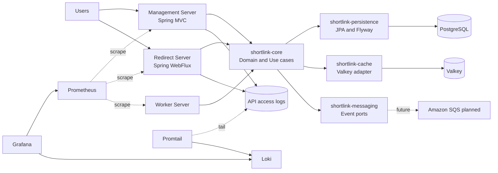

# Short URL

Java 21, Kotlin, Spring Boot 4 기반의 Short URL 서비스다. 하나의 레포에서 Management Server, Redirect Server, Worker Server와 공통 기능 모듈을 함께 관리하는 모듈러 모놀리스 구조로 개발한다.

## Quick Start

### 1. 준비물

- Java 21
- Docker Desktop
- IntelliJ IDEA 또는 Kotlin/Gradle을 실행할 수 있는 IDE
- HTTP Client: IntelliJ HTTP Client, VS Code REST Client, curl 중 하나

Gradle은 wrapper를 사용한다.

```bash
./gradlew --version
```

### 2. 로컬 인프라 실행

PostgreSQL, Valkey, Prometheus, Loki, Promtail, Grafana를 Docker Compose로 실행한다.

```bash
docker compose up -d postgres valkey prometheus loki promtail grafana
docker compose ps
```

기본 앱 설정은 PostgreSQL과 Valkey가 로컬에서 떠 있다고 가정한다.

### 3. 앱 서버 실행

터미널을 3개 열고 각각 실행한다.

```bash
./gradlew :apps:management-server:bootRun
```

```bash
./gradlew :apps:redirect-server:bootRun
```

```bash
./gradlew :apps:worker-server:bootRun
```

기본 포트:

| App | Port | 역할 |
| --- | ---: | --- |
| Management Server | 8080 | Short URL 생성/조회 API |
| Redirect Server | 8081 | Short code redirect API |
| Worker Server | 8082 | Redirect event polling worker |

헬스 체크:

```bash
curl http://localhost:8080/actuator/health
curl http://localhost:8081/actuator/health
curl http://localhost:8082/actuator/health
```

### 4. API 테스트

IntelliJ HTTP Client 또는 VS Code REST Client에서는 [docs/http/short-url.http](docs/http/short-url.http)를 실행한다.

curl로 테스트할 때:

```bash
curl -X POST http://localhost:8080/api/v1/short-links \
  -H 'Content-Type: application/json' \
  -d '{"originalUrl":"https://example.com/articles/1"}'
```

응답 예시:

```json
{
  "code": "0QHPTGT9W756F",
  "originalUrl": "https://example.com/articles/1",
  "shortUrl": "http://localhost:8081/0QHPTGT9W756F",
  "createdAt": "2026-05-30T16:56:41.292795Z",
  "expiresAt": null,
  "active": true
}
```

Redirect 테스트:

```bash
curl -v http://localhost:8081/{code}
```

### 5. 테스트 실행

전체 테스트:

```bash
./gradlew test
```

테스트와 각 앱 bootJar 패키징:

```bash
./gradlew test :apps:management-server:bootJar :apps:redirect-server:bootJar :apps:worker-server:bootJar
```

### 6. k6 부하 테스트

앱 서버가 `8080`, `8081`, `8082`에서 실행 중인 상태에서 k6를 Docker로 실행한다.

Smoke test:

```bash
docker compose run --rm k6 run /scripts/short-url-smoke.js
```

Redirect read path 부하 테스트:

```bash
docker compose run --rm \
  -e VUS=100 \
  -e DURATION=5m \
  -e SHORT_URL_COUNT=1000 \
  k6 run /scripts/redirect-load.js
```

생성/리다이렉트 혼합 부하 테스트:

```bash
docker compose run --rm \
  -e VUS=50 \
  -e DURATION=3m \
  -e SHORT_URL_COUNT=500 \
  -e CREATE_RATIO=0.10 \
  k6 run /scripts/mixed-load.js
```

자세한 내용은 [docs/load-testing.md](docs/load-testing.md)를 참고한다.

## 개발 도구와 접속 URL

| 도구 | URL/접속 정보 | 용도 |
| --- | --- | --- |
| Management API | http://localhost:8080 | Short URL 생성/조회 |
| Redirect API | http://localhost:8081 | Short code redirect |
| Worker Actuator | http://localhost:8082/actuator/health | Worker 상태 확인 |
| PostgreSQL | `localhost:5432`, DB/user/password: `short_url` | Short URL 저장소 |
| Valkey | `localhost:6379` | Redirect cache |
| Prometheus | http://localhost:9090 | Metrics 조회 |
| Prometheus Targets | http://localhost:9090/targets | Scrape target 상태 확인 |
| Grafana | http://localhost:3000, `admin/admin` | Dashboard |
| Short URL Overview | http://localhost:3000/d/short-url-overview/short-url-overview | JVM, HTTP, DB pool, redirect metric |
| Short URL API Logs | http://localhost:3000/d/short-url-api-logs/short-url-api-logs | API 호출 로그, status, URL, 응답시간 |
| Loki | http://localhost:3100/ready | Log storage readiness |
| k6 | `docker compose run --rm k6 ...` | 부하 테스트 |
| Management Prometheus | http://localhost:8080/actuator/prometheus | Management metrics |
| Redirect Prometheus | http://localhost:8081/actuator/prometheus | Redirect metrics |
| Worker Prometheus | http://localhost:8082/actuator/prometheus | Worker metrics |

PostgreSQL 접속 확인:

```bash
docker compose exec -T postgres psql -U short_url -d short_url -c "select current_database(), current_user;"
```

Valkey 접속 확인:

```bash
docker compose exec -T valkey valkey-cli ping
```

Loki 로그 조회 예시:

```bash
curl -G http://localhost:3100/loki/api/v1/query \
  --data-urlencode 'query={log_type="api_access"} | json'
```

## 아키텍처



### 서버 책임

- `apps:management-server`
  - Short URL 생성
  - Short URL 단건 조회
  - 최근 Short URL 목록 조회
  - Spring MVC 기반

- `apps:redirect-server`
  - `GET /{code}` redirect
  - Caffeine local cache, Valkey cache 순서로 조회
  - cache miss 시 PostgreSQL fallback
  - WebFlux 기반
  - JPA/RedisTemplate 호출은 `boundedElastic`으로 격리

- `apps:worker-server`
  - Redirect event polling worker 골격
  - 현재는 메시징 포트와 No-op/로깅 어댑터 중심

### 모듈 책임

| Module | 책임 |
| --- | --- |
| `modules:common` | 공통 응답 모델, API access log JSON writer |
| `modules:shortlink-core` | 도메인 규칙, 유스케이스, 포트 인터페이스 |
| `modules:shortlink-persistence` | PostgreSQL/JPA adapter, Flyway migration |
| `modules:shortlink-cache` | In-memory cache, Valkey/Redis adapter |
| `modules:shortlink-messaging` | Redirect event publisher/consumer 기본 adapter |

의존 방향은 앱에서 기능 모듈로 향한다. `shortlink-core`는 인프라 구현을 모르고, persistence/cache/messaging 모듈이 core의 port를 구현한다.

```text
apps:* -> modules:shortlink-core
apps:* -> modules:shortlink-persistence/cache/messaging
modules:shortlink-persistence -> modules:shortlink-core
modules:shortlink-cache -> modules:shortlink-core
modules:shortlink-messaging -> modules:shortlink-core
```

## 주요 기술 스택

| 영역 | 기술 |
| --- | --- |
| Runtime | Java 21 |
| Language | Kotlin 2.2.21 |
| Framework | Spring Boot 4.0.6 |
| Management API | Spring MVC |
| Redirect API | Spring WebFlux |
| Persistence | Spring Data JPA, PostgreSQL |
| Migration | Flyway |
| Cache | Valkey, Spring Data Redis |
| Short code | TSID, `tsid-creator` |
| Metrics | Spring Boot Actuator, Micrometer, Prometheus |
| Logs | JSON line access log, Promtail, Loki |
| Dashboard | Grafana |
| Load test | k6 |
| Build/Test | Gradle Wrapper, JUnit 5, Kotlin test |

## 데이터베이스와 마이그레이션

DB schema 생성/수정/삭제는 Flyway로만 관리한다. Hibernate는 schema를 만들지 않고 `validate`만 수행한다.

Migration 위치:

```text
modules/shortlink-persistence/src/main/resources/db/migration
```

현재 최초 migration:

```text
V1__create_short_links.sql
```

애플리케이션 데이터 insert/update/delete는 Flyway migration으로 관리하지 않는다.

## 캐시 전략

Redirect Server는 read path에서 cache-aside 전략을 사용한다.

1. Caffeine local cache에서 redirect cache entry 조회
2. local miss면 Valkey에서 redirect cache entry 조회
3. `FOUND`면 DB 조회 없이 redirect
4. `NOT_FOUND`면 DB 조회 없이 404
5. `GONE`이면 DB 조회 없이 410
6. Cache miss면 Redis 기반 cache load lock으로 DB stampede를 완화
7. lock owner가 PostgreSQL 조회 후 결과를 Caffeine local cache와 Valkey에 저장
8. TTL jitter, local single-flight, Redis distributed lock으로 cache stampede와 hot key 부하를 완화
9. Valkey 장애 시 redirect는 DB fallback으로 fail-open

자세한 내용은 [docs/cache-strategy.md](docs/cache-strategy.md)를 참고한다.

## 관측성

### Metrics

각 앱은 `/actuator/prometheus` endpoint를 노출한다. Prometheus는 Docker container에서 실행되므로 로컬 JVM 앱은 `host.docker.internal`로 scrape한다.

Redirect custom metrics:

```text
short_url_redirect_cache_total{result="hit|miss"}
short_url_redirect_resolution_total{outcome="found|not_found|gone"}
```

### API Access Logs

Management Server와 Redirect Server는 API 호출 단위 로그를 JSON line으로 남긴다.

```text
logs/short-url-management-server/api-access.log
logs/short-url-redirect-server/api-access.log
```

기본 필드:

```text
timestamp, application, method, uri, path, query, status, status_family,
duration_ms, remote_addr, user_agent, trace_id, metric
```

Promtail이 위 파일을 Loki로 전송하고, Grafana의 `Short URL API Logs` 대시보드에서 조회한다. Actuator 요청은 access log에서 제외한다.

자세한 내용은 [docs/observability.md](docs/observability.md)를 참고한다.

## 부하 테스트

k6 스크립트는 `load-tests/k6` 아래에 있다.

```text
short-url-smoke.js
redirect-load.js
mixed-load.js
```

k6 컨테이너에서 호스트 앱으로 접근해야 하므로 기본 base URL은 `host.docker.internal`을 사용한다.

```text
MANAGEMENT_BASE_URL=http://host.docker.internal:8080
REDIRECT_BASE_URL=http://host.docker.internal:8081
```

부하 테스트 중에는 Grafana의 `Short URL Overview`와 `Short URL API Logs` 대시보드를 함께 확인한다. 자세한 실행 방법과 threshold 기준은 [docs/load-testing.md](docs/load-testing.md)를 참고한다.

## 자주 쓰는 명령어

```bash
# 인프라 실행
docker compose up -d postgres valkey prometheus loki promtail grafana

# 인프라 상태 확인
docker compose ps

# 전체 테스트
./gradlew test

# 전체 테스트 + 앱 패키징
./gradlew test :apps:management-server:bootJar :apps:redirect-server:bootJar :apps:worker-server:bootJar

# k6 smoke test
docker compose run --rm k6 run /scripts/short-url-smoke.js

# k6 redirect load test
docker compose run --rm -e VUS=100 -e DURATION=5m -e SHORT_URL_COUNT=1000 k6 run /scripts/redirect-load.js

# Management Server 실행
./gradlew :apps:management-server:bootRun

# Redirect Server 실행
./gradlew :apps:redirect-server:bootRun

# Worker Server 실행
./gradlew :apps:worker-server:bootRun
```

## 참고 문서

- [docs/architecture.md](docs/architecture.md)
- [docs/tech-stack.md](docs/tech-stack.md)
- [docs/planning.md](docs/planning.md)
- [docs/api.md](docs/api.md)
- [docs/cache-strategy.md](docs/cache-strategy.md)
- [docs/observability.md](docs/observability.md)
- [docs/load-testing.md](docs/load-testing.md)
- [docs/harness/ERROR_NOTE.md](docs/harness/ERROR_NOTE.md)
- [AGENT.md](AGENT.md)

## 개발 협업 규칙

이 프로젝트는 [AGENT.md](AGENT.md)를 기준으로 개발한다.

- 개발 요청을 받으면 먼저 계획을 공유하고 동의를 받는다.
- 동의 후 구현, 코드 리뷰, 테스트, 문서, 하네스 오답 노트를 함께 남긴다.
- 모듈러 모놀리스 경계를 지킨다.
- DB schema 생성/수정/삭제는 Flyway로만 처리한다.
