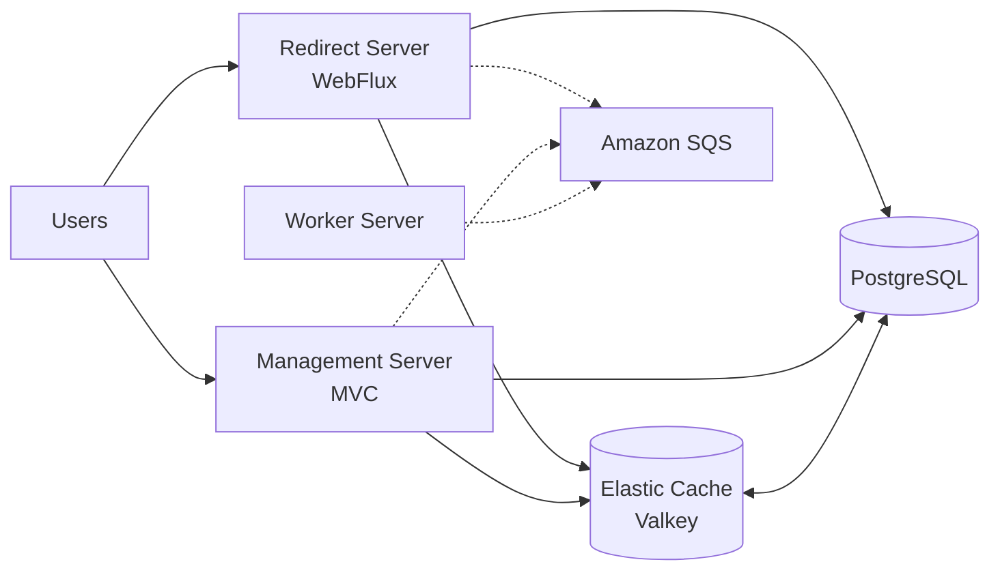

# Architecture

`short-url`은 하나의 레포에서 세 개의 서버 앱과 공통 기능 모듈을 함께 관리하는 모듈러 모놀리스 구조다.

## 서버 구성



## Gradle 모듈

- `apps:management-server`: Short URL 생성/조회 관리 API. Spring MVC 기반.
- `apps:redirect-server`: 짧은 코드 리다이렉트 API. Spring WebFlux 기반.
- `apps:worker-server`: 리다이렉트 이벤트 소비와 후속 비동기 처리.
- `modules:shortlink-core`: 도메인 규칙, 유스케이스, 포트 인터페이스.
- `modules:shortlink-persistence`: PostgreSQL/JPA 저장소 어댑터.
- `modules:shortlink-cache`: Valkey/Redis 캐시 어댑터와 로컬 인메모리 캐시.
- `modules:shortlink-messaging`: SQS 메시징 포트의 기본 로깅/No-op 어댑터.
- `modules:common`: 공통 응답 모델.

## 의존 방향

앱 모듈은 필요한 기능 모듈에 의존한다. 기능 모듈은 `shortlink-core`의 포트에 맞춰 구현되며, core는 인프라 구현을 모른다.

```text
apps:* -> modules:shortlink-core
apps:* -> modules:shortlink-persistence/cache/messaging
modules:shortlink-persistence -> modules:shortlink-core
modules:shortlink-cache -> modules:shortlink-core
modules:shortlink-messaging -> modules:shortlink-core
```

## 리다이렉트 흐름

1. `GET /{code}` 요청이 `redirect-server`로 들어온다.
2. `RedirectResolver`가 `ShortLinkCache`에서 원본 URL을 먼저 조회한다.
3. 캐시 미스면 `ShortLinkRepository`로 PostgreSQL을 조회한다.
4. 만료 또는 비활성 상태가 아니면 원본 URL을 캐시에 저장한다.
5. 리다이렉트 이벤트를 `RedirectEventPublisher`로 발행한다.
6. HTTP 302 응답으로 원본 URL 위치를 내려준다.

WebFlux 서버에서 JPA와 RedisTemplate 기반 호출은 blocking 작업이므로 컨트롤러에서 `boundedElastic` 스케줄러로 격리한다.

## 관리 흐름

1. `POST /api/v1/short-links`로 원본 URL과 선택적 custom code를 받는다.
2. 도메인에서 URL과 code 규칙을 검증한다.
3. custom code가 없으면 base62 랜덤 코드를 생성하고 중복 여부를 확인한다.
4. PostgreSQL에 저장한 뒤 redirect 서버 기준 short URL을 응답한다.

## 워커 흐름

현재 워커는 `RedirectEventConsumer`에서 이벤트를 가져와 `RedirectEventProcessor`에 넘기는 골격을 제공한다. 실제 Amazon SQS 연동은 `modules:shortlink-messaging`에 SQS 어댑터를 추가하는 방식으로 확장한다.
